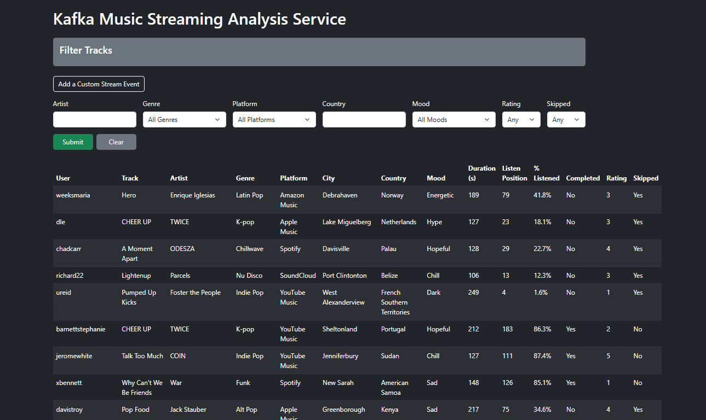

# Real-Time Kafka Music Streaming Analysis

This project demonstrates a simplified real-time data pipeline using **Apache Kafka**, **Flask**, and **Docker** to simulate music streaming events. It tracks who’s listening, what they’re listening to, where they’re listening from, and how they interact with each track.

---

## What This Project Does

We created a real-time streaming web app that mimics a music analytics dashboard. Every few seconds, it sends out new simulated music stream events like:

- A user in **Japan** streamed “Glimpse of Us” on **Spotify** feeling **Melancholy**
- Someone in **Colombia** listened to “Tokyo” on **YouTube Music**, skipped it, and rated it **4**

Each message contains metadata such as:
- Artist, genre, and platform
- Country and city
- Mood tag
- How long the user listened (both seconds and % of the track)
- Whether they completed the song or skipped it
- A numeric user rating from 1 to 5

These events are:
- Sent by a Kafka **producer**
- Received by a Kafka **consumer**
- Displayed on a **Flask web interface**
- Filterable by artist, genre, platform, country, mood, rating, or whether the song was skipped

This simulates how actual music streaming platforms analyze listener behavior, using randomized data for educational purposes.

---

## What We Used

| Layer        | Tool/Tech          | Purpose |
|--------------|--------------------|---------|
| Data Stream  | Apache Kafka       | Message broker for real-time event streaming |
| Backend      | Python + Flask     | Web server, consumer integration, filtering |
| Frontend     | HTML + Bootstrap   | Dashboard UI, filtering forms |
| Container    | Docker + Compose   | Orchestration of Kafka services |
| Faker        | Python Faker lib   | Generates realistic but fake user data |

---

## How It Works

### 1. Producer (`producer.py`)
- Uses `Faker` to simulate:
  - `user_id`, `username`, and `email`
  - Song `title`, `artist`, and `genre` (pulled from a pre-defined curated list)
  - Platform (Spotify, YouTube Music, Apple Music, SoundCloud, etc.)
  - Mood tag (e.g. Chill, Energetic, Sad)
  - `duration` (randomized song length in seconds)
  - `listen_position` (how far into the song the user listened)
  - `completed` (boolean if they reached the end)
  - `rating` (float from 1.0 to 5.0)
  - `skipped` (true if stopped early)
- Sends a new message every 2 seconds into the Kafka topic `music-streams`

### 2. Consumer (`consumer.py`)
- Subscribes to `music-streams`
- Consumes data in real time and stores the latest 50 messages in memory
- Outputs each received message to the terminal for inspection

### 3. Flask App (`app.py`)
- Launches a live dashboard on `http://localhost:5000`
- Displays all consumer messages as rows in a Bootstrap-styled table
- Shows:
  - Song metadata and user location
  - Mood, completion status, skip status, rating
  - How long the track is
  - **Listen Position** (seconds)
  - **% Listened** (normalized view of how much of the track was played)
- Allows filtering by:
  - Artist
  - Genre (dropdown)
  - Platform (dropdown)
  - Country
  - Mood (dropdown)
  - Rating
  - Skipped (yes/no)

The form preserves the selections & the page can be refreshed manually to view an updated list of tracks and their  statistics.

---

### Kafka and Big Data Concepts

- Kafka supports **real-time streaming**, which is fundamental to Big Data pipelines
- Uses **partitioning** to distribute workload across nodes or brokers
- Messages are **append-only**, which is ideal for logs, streams, and events
- Enables **loose coupling** between producers and consumers

In our case, Producers do not need to know who consumes the data, and consumers can independently scale or process messages as they need.

#### Kafka Terminology

- **Topic**: A category to which records are sent (in our case: `music-streams`)
- **Partition**: A segment of a topic that allows Kafka to scale horizontally
- **Broker**: A Kafka server that stores messages and serves client requests
- **Producer**: The component that sends messages to a Kafka topic
- **Consumer**: The component that reads from the topic in real time

---

## Docker and Architecture

Docker Compose runs both Kafka and Zookeeper so we can:
- Set up the broker system locally
- Simulate a multi-component distributed pipeline
- Avoid installing Kafka globally on your machine

---

## Relation to Cassandra & Data Modeling

If we were using Cassandra or designing a real schema, a good data model might look like:

```sql
CREATE TABLE music_streams_by_user (
    user_id UUID,
    timestamp BIGINT,
    title TEXT,
    artist TEXT,
    genre TEXT,
    mood TEXT,
    platform TEXT,
    duration INT,
    listen_position INT,
    completed BOOLEAN,
    rating FLOAT,
    skipped BOOLEAN,
    city TEXT,
    country TEXT,
    PRIMARY KEY (user_id, timestamp)
);
```

The above schema supports:

- High-speed inserts  
- Time-ordered user data  
- Fast access to the most recent activity  
- Grouping data by user or by time range

---

## How to Run the Project

### 1. Start Kafka and Zookeeper with Docker

From the project root:

```bash
docker compose up -d
```

This will run Kafka and Zookeeper in the background.

### 2. Run the Kafka Producer

In a second terminal:

```bash
python producer.py
```

### 3. Run the Flask Web App

In a third terminal:

```bash
python app.py
```

### 4. View the Dashboard

Go to [http://localhost:5000](http://localhost:5000) in your browser. You should see real-time data begin to populate the table. Use the form at the top to filter by any field.

---

## Live Dashboard Preview

This is how the real-time data appears when viewed in the Flask web app:



---

## Future Considerations

To push this project further:

- Add persistent storage using Cassandra or PostgreSQL  
- Create graphs or visual analytics (e.g. genre distribution, skip/drop-off trends)  
- Use Kafka Connect or Spark Streaming for processing  
- Simulate spikes in traffic or multi-user concurrency  
- Store data in HDFS or S3 for batch analysis (as we are becoming experts in Amazon AWS)

---

## Team Members

- Hayoung Jung  
- Anjana Madhaven  
- Taylor Peterson

---

## Summary

This project simulates a simplified Big Data pipeline using Kafka and Flask. It incorporates concepts of producers, consumers, brokers, message topics, filtering, and partitioning. The architecture and schema design are similar to what you might see in real platforms using Cassandra to analyze user behavior.

In addition to core functionality, this project includes:
- Mood classification
- Completion detection
- Skipping behavior
- User rating input
- Percentage of song played for engagement tracking

