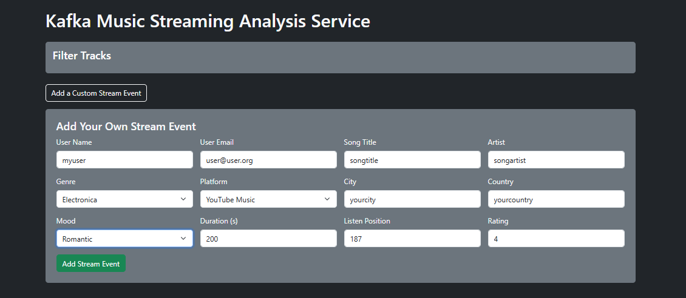
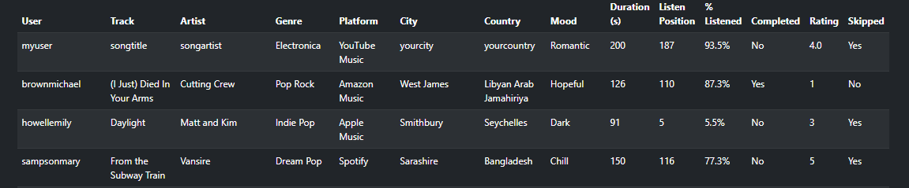

# Real-Time Kafka Music Streaming Analysis

This project demonstrates a simplified real-time data pipeline using **Apache Kafka**, **Flask**, and **Docker** to simulate music streaming events. It tracks who’s listening, what they’re listening to, where they’re listening from, and how they interact with each track.

---

## What This Project Does

We created a real-time streaming web app that mimics a music analytics dashboard. Every few seconds, it sends out new simulated music stream events like:

- A user in **Japan** streamed “Glimpse of Us” on **Spotify** feeling **Melancholy**
- Someone in **Colombia** listened to “Tokyo” on **YouTube Music**, skipped it, and rated it **4**

Each message contains metadata such as:
- Artist, genre, and platform
- Country and city
- Mood tag
- How long the user listened (both seconds and % of the track)
- Whether they completed the song or skipped it
- A numeric user rating from 1 to 5

These events are:
- Generated initial genre, songs, and platform tables in a folder named `generate_data`
- Sent by a Kafka **producer**
- Received by a Kafka **consumer**, which consumes and optionally processes streamed messages in real time
- Generated Faker data is stored in Firebase, so the app doesn't reset to zero when restarted
- Displayed on a **Flask web interface**
- Filterable by artist, genre, platform, country, mood, rating, or whether the song was skipped

This simulates how actual music streaming platforms analyze listener behavior, using randomized data for educational purposes.

---

## What We Used

| Layer        | Tool/Tech          | Purpose |
|--------------|--------------------|---------|
| Data Stream  | Apache Kafka       | Message broker for real-time event streaming |
| Data Storage | Firebase           | Storing initial data for songs, platforms, & moods. Saving data for each time the server started. Storing streaming events. |
| Backend      | Python + Flask     | Web server, consumer integration, filtering |
| Frontend     | HTML + CSS (Bootstrap)   | Dashboard UI, filtering forms |
| Container    | Docker + Compose   | Kafka services |
| Faker        | Python Faker lib   | Generates fake user data |

---

## How It Works


### 1. Generate Data (`generate_data`)
- Stores initial data into songs, mood, and platform collections.
- Uses Firestore's config to populate collections with initial data
- `store_songs` 
  - Creates initial song table with song title as document id  
  - Fields of **title** (title of the song), **artist** (who made the song), & **genre** (category the song belongs in).
  - Generates sample data for songs. Users can also add songs manually through the form interface which automatically updates the database.
- `store_platforms`
  - Creates platform table with platform **name** as document id
  - Only field is name (platform name)
- `store_moods`
  - Creates mood table with mood **name** as document id
  - Only field is name (mood name)
- `store_genres`
  * This generates the **genres** DB. It populates to the DB with an array of inital genres + it goes through the song DB and takes every genre from there as well. 
  * This DB is where Faker grabs the **genres**

### 2. Producer (`producer.py`)
- Uses `Faker` to simulate:
  - `user_id`, `username`, and `email`
  - Song `title`, `artist`, and `genre` (pulled from a pre-defined curated list)
  - Platform (Spotify, YouTube Music, Apple Music, SoundCloud, etc.)
  - Mood tag (Chill, Energetic, Sad, etc.)
  - `duration` (randomized song length in seconds)
  - `listen_position` (how far into the song the user listened)
  - `completed` (boolean if they reached the end)
  - `rating` (float from 1.0 to 5.0)
  - `skipped` (true if stopped early)
- Sends a new message every 2 seconds into the Kafka topic `music-streams`.

### 3. Consumer (`consumer.py`)
- Subscribes to  `music-streams` Kafka topic
- Consumes data in real time and prints messages to the terminal for verification
- Could be extended to include analytics, transformation, etc.

### 4. Flask App (`app.py`)
- Launches a live dashboard on `http://localhost:5000`
- Displays all consumer messages as rows in a Bootstrap-styled table
- Shows:
  - Song metadata and user location
  - Mood, completion status, skip status, rating
  - How long the track is
  - **Listen Position** (seconds)
  - **% Listened** (normalized view of how much of the track was played)
- Allows filtering by:
  - Artist
  - Genre (dropdown)
  - Platform (dropdown)
  - Country
  - Mood (dropdown)
  - Rating
  - Skipped (yes/no)
- Functionality to add new stream events  into the `stream_events` collection
  - Fields to complete:
    - User Name
    - User Email
    - Song Title
    - Artist
    - Genre (dropdown)
    - Platform (dropdown)
    - City
    - Country
    - Mood (dropdown)
    - Duration (s) (song duration in seconds)
    - Listen Position (where the user stops listening)
    - Rating (0-5)
    - Completed 

The form preserves the selections & the page can be refreshed manually to view an updated list of tracks and their  statistics.

---

### Kafka and Big Data Concepts

- Kafka supports **real-time streaming**, which is fundamental to Big Data pipelines
- Uses **partitioning** to distribute workload across nodes or brokers
- Messages are **append-only**, which is ideal for logs, streams, and events
- Enables "loose coupling" between producers and consumers
- Kafka enables "decoupled architecture", where producers and consumers operate independently and asynchronously
- Ourp project uses Kafka’s fault-tolerant message queue, so events don’t get lost even if the dashboard is restarted
- While this project uses one topic, Kafka is designed to scale to many producers and consumers, handling massive amounts of data across distributed systems

#### Kafka Terminology

- **Topic**: A category to which records are sent (in our case: `music-streams`)
- **Partition**: A segment of a topic that allows Kafka to scale horizontally
- **Broker**: A Kafka server that stores messages and serves client requests
- **Producer**: The component that sends messages to a Kafka topic
- **Consumer**: The component that reads from the topic in real time

---

## Docker and Architecture

Docker Compose runs both Kafka and Zookeeper so we can:
- Set up the broker system locally
- Simulate a multi-component distributed pipeline
- Avoid installing Kafka globally on your machine

---

## Relation to Cassandra & Data Modeling

If we were using Cassandra or designing a real schema, a good data model might look like:

```sql
CREATE TABLE music_streams_by_user (
    user_id UUID,
    timestamp BIGINT,
    title TEXT,
    artist TEXT,
    genre TEXT,
    mood TEXT,
    platform TEXT,
    duration INT,
    listen_position INT,
    completed BOOLEAN,
    rating FLOAT,
    skipped BOOLEAN,
    city TEXT,
    country TEXT,
    PRIMARY KEY (user_id, timestamp)
);
```

The above schema supports:

- High-speed inserts  
- Time-ordered user data  
- Fast access to the most recent activity  
- Grouping data by user or by time range

---

## How to Run the Project

Ensure that you have Docker installed and Python 3 available on your system

### Clone the Repository / Navigate to Project Folder

If you haven't already, open a bash terminal in the desired directory and run:

```bash
git clone https://github.com/YOUR-USERNAME/kafka-music-streaming.git
cd kafka-music-streaming
```


### 1. Start Kafka and Zookeeper with Docker

From the root of the project folder, (where `docker-compose.yml` is located) run:

```bash
docker compose up -d
```

This starts Kafka and Zookeeper in the background. 

### 2. Run the Kafka Producer

In a second terminal window, in the project directory:

```bash
python producer.py
```

### 3. Run the Flask Web App

In a third terminal window, in the project directory:

```bash
python app.py
```

You’ll see * Running on http://127.0.0.1:5000/ in the terminal output.

### 4. View the Dashboard

Go to [http://localhost:5000](http://localhost:5000) in your browser. The table should begin filling up with stream data. You can use the filter options at the top of the page to search by artist, genre, mood, country, platform, rating, etc.

---

## Live Dashboard Preview

This is how the real-time data appears when viewed in the Flask web app:


Users can fill out the **"Add A Custom Stream Event** form to add their own data:



Once submitted, users will see their event added to the table (successful addition displayed at the top of the table):



---

## Future Considerations

To push this project further:

- Add persistent storage using Cassandra or PostgreSQL  
- Create graphs or visual analytics (e.g. genre distribution, skip/drop-off trends)  
- Use Kafka Connect or Spark Streaming for processing  
- Simulate spikes in traffic or multi-user concurrency  
- Store data in HDFS or S3 for batch analysis (as we are becoming experts in Amazon AWS)

---

## Team Members

- Hayoung Jung  
- Anjana Madhaven  
- Taylor Peterson

---

## File Structure/Description

Folder | `generate_data` 

We **must** run `store_songs` before `store_genres` as `store_genres` is dependent on `store_songs`


* `store_songs` 
  * Inital songs database gets populated with an array for Faker to start fetching from prior to any users adding their stream events [inital population]
  * Since there are two ways we populate the DB, the second way is through add stream event. When a user submits a form, the code checks the DB to see if the song already exists. If not, a document is added to the **song** DB to represent the song 
* `store_moods` 
  * This generates the mood DB with all of the moods that you can choose for a song. This is a finite number of moods, because that's all we wanted to allow & prevents the need to update after every stream event. 
  * This DB is where Faker pulls the **moods**
* `store_platforms ` 
  * This generates the **platform** DB with the only 5 streaming platforms that we allow to be included in the DB/project. 
  * This DB is where Faker pulls the **platforms**
* `store_genres`
  * This generates the **genres** DB. It populates to the DB with an array of inital genres + it goes through the song DB and takes every genre from there as well. 
  * This DB is where Faker pulls the **genres**
---

## Summary

This project simulates a simplified Big Data pipeline using Kafka and Flask. It incorporates concepts of producers, consumers, brokers, message topics, filtering, and partitioning. The architecture and schema design are similar to what you might see in real platforms using Cassandra to analyze user behavior.

In addition to core functionality, this project includes:
- Mood classification
- Completion detection
- Skipping behavior
- User rating input
- Percentage of song played for engagement tracking

